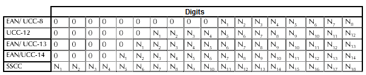
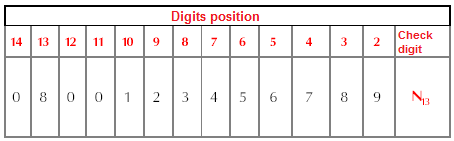

# Barcode check-digit calculator

The exercise consists to develop a sample VCL application, using Delphi language, to calculate the check-digit for an UCC/EAN code as described in the technical specifications section. The VCL sample application must be developped using Model-View-Presenter design pattern that allows you to separate different responsabilities, implementing the View, the Model and the Presenter.

Technical specifications
========================

The UCC/EAN standard coding requires that every (well formed) barcode ends with a check-digit that will be used by barcode readers to interpret the code properly. The check-digit is a number between zero and nine (0-9) and it is calculated according to the other digits in the code. The calculation algorithm requires that every digit in the code is enumerated from right to left as shown in the following picture (Source: [INDICOD-ECR](it.wikipedia.org/wiki/Indicod-Ecr)).

After you have enumerated each digit of the given code, to determine the check-digit you will have to:

1. Add up the digits in even position
2. Multiply the result of the previous step (the first step) to 3 (three)
3. Add up the digits in the odd positions
4. Add up the results obtained in steps two and three
5. Subtract the upper multiple of 10 from the result obtained in step four (example: if the result of the step four is 47, you have to subtract 50 from 47, so the result is 3)

If the result of the four step is a multiple of Ten (10), like Twenty, Thirty, Forty and so on, the check-digit will be equal to zero, otherwise the check-digit will be the result of the five step

The *input* consists of an EAN13 barcode without the check-digit. The *output* consists of the check-digit for the given EAN13 barcode.

Algorithm implementations
===================

The algorithm for calculate the check-digit must be implemented in T-SQL (using [T-SQL User-defined Functions](https://docs.microsoft.com/en-us/sql/relational-databases/user-defined-functions/create-user-defined-functions-database-engine)) and in Delphi language as well. You can save the functions AdventureWorks database on SQL Azure instance you already known.

Goals to achieve
================

- Implementing T-SQL user defined functions and use it in a Delphi application
- Understand the Model View Presenter (M-V-P) design pattern
- Set-based thinking (T-SQL)

Folders organization
====================

In the [cappellari-institute/Barcode check-digit calculator/](https://github.com/segovoni/cappellari-institute/tree/master/Barcode%20check-digit%20calculator) folder there is one sub-folder for each of you, the subfolder name is composed by the first character of your lastname plus the first character of your firstname. For example, my subfolder is GS. Put all your files in your subfolder (you can also create subfolders in your folder), try to do a well organization of your files.

For any questions or doubts don't hesitate to contact me.

Enjoy the barcode check-digit calculator!
