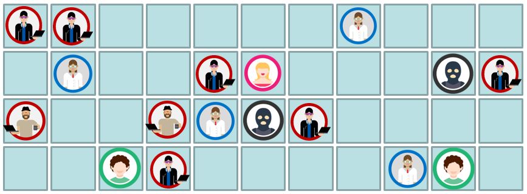
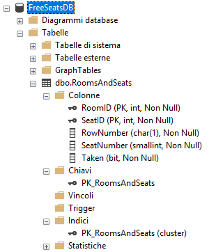

# Free Seats sample application

The exercise consists to develop a sample VCL application, using Delphi language, to solve the "free seats" problem that is described in the technical specifications section. The VCL sample application must be done using Model-View-Presenter design pattern that allows you to separate different responsabilities, implementing the View, the Model and the Presenter.

Technical specifications
========================

There is a group of people whose number is defined, the Free Seats sample application is able find in what line of a cinema or theater, there is enough space for these people to have all the nearby seats.

The *input* consists of the number of people who want to buy a carnet of tickets for a movie in our cinema or for a theater show. The *output* consists of the coordinates where the group of people can find the exact number of the nearby free seats.

Free Seats database
===================

The Free Seats sample application works with *FreeSeatsDB* that is hosted on a SQL Server instance running on SQL Azure. You should have already received the credentials for connecting to SQL Azure. The main table in the *FreeSeatsDB* is *dbo.RoomsAndSeats*. The following picture shows the schema of the table *dbo.RoomsAndSeats*.

